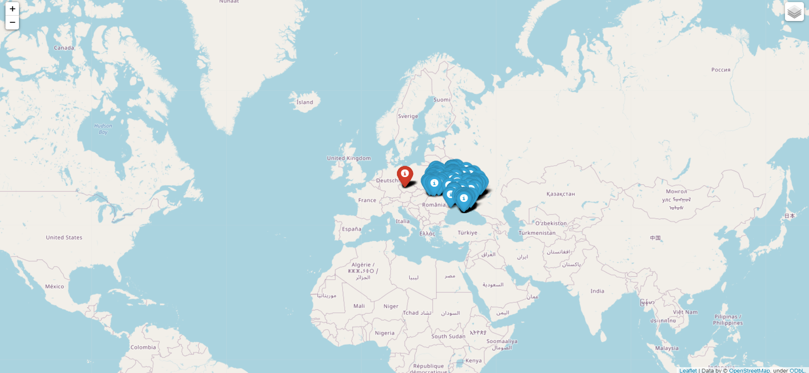
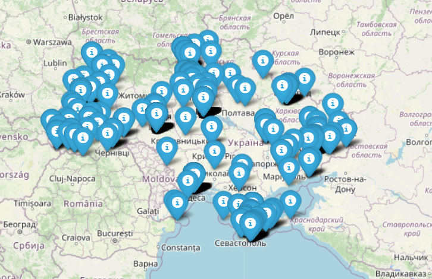
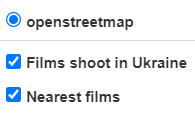

# Film map

Project, which creates film map based on the given data.

First layer of the map contains markers of 10 (or fewer) nearest films to the point provided by user.

Second layer contains markers of films shoot in Ukraine.

## How to install

1. Download the repository.
2. Make sure your interpreter meet the requirements in requirements.txt.
## Usage
Launch the command line and go to the downloaded repository. Then type:

```bash
main.py year latitude longitude path_to_your_dataset
```

## Result
If everything goes OK, you will see a message about success. Then open Films_map.html which should appear in the same repository.

General view:


Markers of the first layer are red:


Markers of the first layer are blue:


By clicking on markers, you can see some info about the film:


You can also change layout in the option menu:

## Cache
It is highly recommended to download cache (data/places_database.csv). Terrificly speeds up the process.
## License
[MIT](LICENSE.txt)
